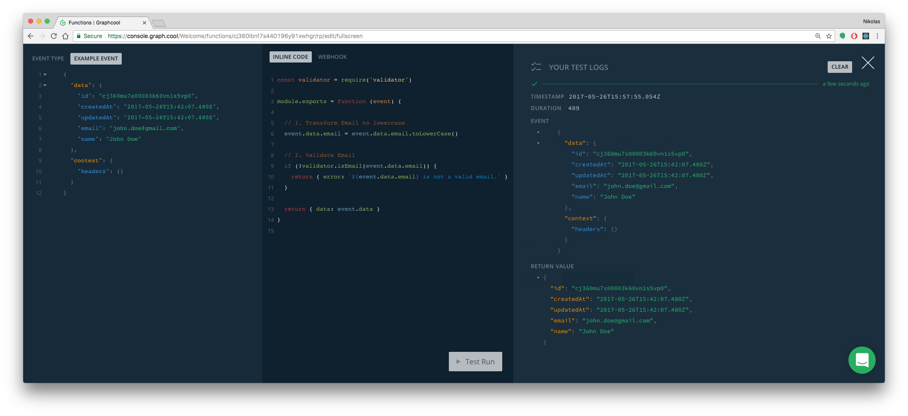
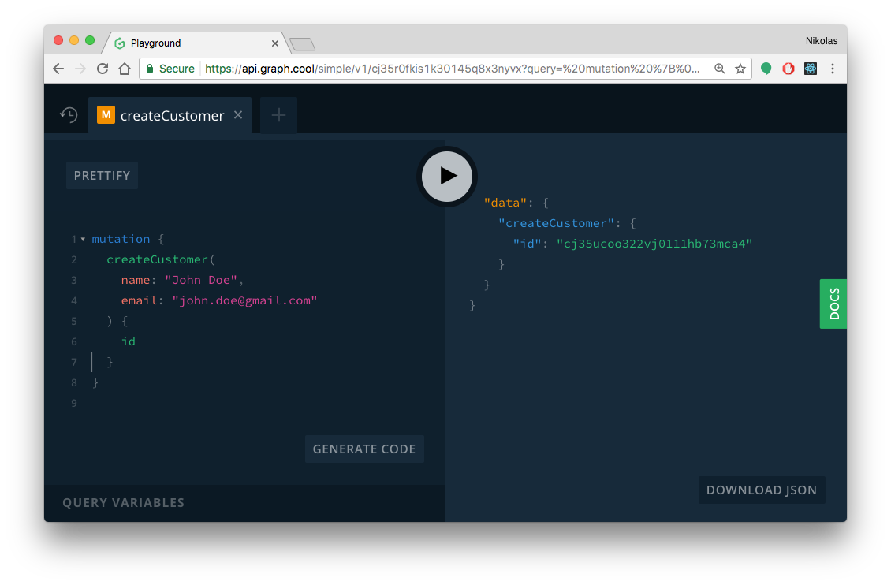

# Validating and Transforming Mutation Input

In this article, you'll learn how to use serverless functions to validate an email address and make sure it gets saved in the database in lowercase letters.

<iframe width="560" height="315" src="https://www.youtube.com/embed/GSV58k05vZI" frameborder="0" allowfullscreen></iframe>

## Overview: Serverless Functions

[Serverless Functions](https://en.wikipedia.org/wiki/Serverless_computing), also referred to as Functions as a Service (FaaS), enable developers to write and deploy independent pieces of functionality without having to deal with setting up and configuring the server environment. 

In that sense, they are similar to microservices, where each function represents one microservice, but again, without the developer having to deal with configuration or deployment overhead. Instead, they can take advantage of the server infrastructures of FaaS providers such as [AWS Lambda](https://serverless.com/framework/docs/providers/aws/guide/functions/), [Google Cloud Functions](https://cloud.google.com/functions/) or [StdLib](https://stdlib.com/).


## Graphcool Functions

When using Graphcool, you can use serverless functions to extend the functionality of your backend. A few common use cases are:

- _transforming_ data, e.g. removing the spaces from a credit card number
- _validating_ data, e.g. ensuring an email address is correct
- call _third-party services_ like Stripe or Mailgun

These are precisely the features that you can implement with serverless functions! 

You generally have the choice between two different kinds of functions that serve slightly different purposes:

- [**Server-side Subscriptions**](!alias-ahlohd8ohn): Execute a serverless function _after_ a mutation happened in the backend
- [**Request Pipeline**](!alias-pa6guruhaf): Allows for transformation and validation of mutation input and response payload at various stages

The use case of sending a validating and transforming an email address is best implemented with the request pipeline, so that's what we'll discuss in the remainder of this article.


## Getting Started with the Request Pipeline

To implement a function in the request pipeline, you have to go through three major steps:

1. Select a _type_ and _mutation_ to hook in
2. Select a _step_ in the request pipeline
3. Write the actual _function_ that will be executed

In the following, we'll walk through each step in detail with the goal of using the request pipeline to validate and transform the email address of a new user.

### 0. Preparation

If you want to follow along, you need to create a Graphcool project based on the following [schema](https://graphqlbin.com/welcome-rp.graphql):

```graphql
type Customer {
  name: String!
  email: String!
}
```

The easiest way to do so is by using the [Graphcool CLI](https://www.npmjs.com/package/graphcool):

```sh
# Install the Graphcool CLI
npm install -g graphcool

# Create project
graphcool init --schema https://graphqlbin.com/welcome-rp.graphql
```

Once your project was created, you can open it in the [Graphcool Console](https://console.graph.cool), select **Functions** in the left side-menu and click the **New Function** button on top to start configuring the function for the request pipeline:


### 1. Choose Trigger

In the popup, you first need to configure the _event trigger_ that defines when the function should be executed. In our case, that's the request pipeline and the mutation when a `Customer` is _created_:

 

### 2. Select the Step in the Request Pipeline

In the bottom area of the popup, we can choose the _step_ where we want to hook in the function. There are three steps availbale:

- `TRANSFORM_ARGUMENT`: Before the mutation input is validated by Graphcool, i.e. permissions and constraints like `isUnique` are checked, you have the chance to transform and validate the input yourself.
- `PRE_WRITE`: Here you typically call third-party services, e.g. for charging a user with Stripe.
- `TRANSFORM_PAYLOAD`: Sometimes you want to modify the payload that the server sends to the client, that's what you can do in this step.

For our scenario, we use the `TRANSFORM_ARGUMENT` step since we only need to transform and validate the input.

You can then move on to the next tab **Define Function** where we can implement the actual function.


### 3. Write the Function

For the request pipeline, it's important to note that we have an _input_ and an _output_. The _input_ is represented by the _type_ that we chose as the trigger, so in our case it's a JSON object that has the structure of the `Customer`:

```graphql
type CustomerInput {
  id: ID!
  createdAt: DateTime!
  updatedAt: DateTime!
  name: String!
  email: String!
}
```

The _output_ has to be another JSON object and has either one of two fields:

- `data`: When returning the `data` field we're communicating that the validation and transformation were successful and the data can "proceed" to the next step in the request pipeline.
- `error`: If the validation fails, we can return an `error` in the JSON object along with a string that represents the error message. 

With that knowledge, let's go and implement our function:

```js
// 1. Import npm module
const validator = require('validator')

module.exports = function (event) {
  
  // 2. Transform Email to lowercase
  event.data.email = event.data.email.toLowerCase()
  
  // 3. Validate Email
  if (!validator.isEmail(event.data.email)) {
    return { error: `${event.data.email} is not a valid email.` } 
  }
  
  // 4. Return transformed data
  return { data: event.data }
}
```

Let's try to understand the different parts of that function:

1. We're importing a Javascript module that we'll use to validate the email address. Note that imports only work for npm packages that are listed [here](https://tehsis.github.io/webtaskio-canirequire/).
2. Here we're transforming the `email` address to be all lowercase.
3. Next we validate the email address and return the custom `error` if the validation fails.
5. If we got to this point, we simply return the `data` that now contains the lowercase email address.

Once you're done writing the function, you can give a name to the function (e.g. `Transform & Validate Email`) and click the **Create Function** button in the bottom-right.


## Testing 

You can test a function in two different ways:

1. Use the **Run & Edit** button in the popup. This will allow you to define an **Example Event** that adheres to the shape of the `CustomerInput` type:

    ```js
    {
      "data": {
        "id": "cj360mu7s00003k60vn1s5vp0",
        "createdAt": "2017-05-26T15:42:07.480Z",
        "updatedAt": "2017-05-26T15:42:07.480Z",
        "email": "JOHN.DOE@GMAIL.COM",
        "name": "John Doe"
      },
      "context": {
        "headers": {}
      }
    }
    ```
    
    

2. Send an actual mutation to your GraphQL API. You can do that either by having an actual client application that sends the mutation or simply through a Playground. A sample mutation could look as follows:

   ```graphql
   mutation {
     createCustomer(
       name: "John Doe",
       email: "JOHN.DOE@GMAIL.COM"
    ) {
      id
    } 
   ```
   
   

   
## Conclusion

In this article you learned how to setup a function in the [request pipeline](!-ahlohd8ohn) directly in the Graphcool Console. The function is called every time right before a new customer is created and ensures that the email address that was provided is actually valid and further transforms it to only have lowercase characters.


