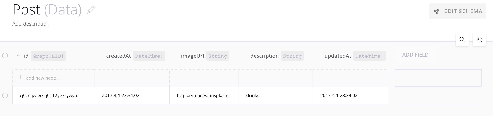
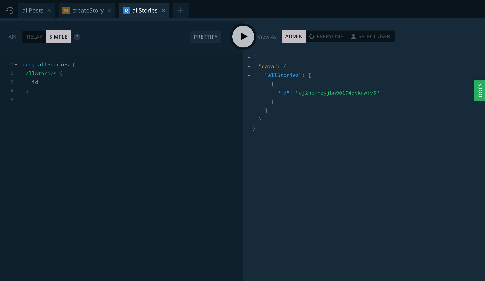
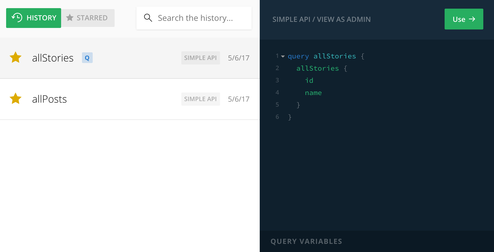

# Console

The [Graphcool Console](http://console.graph.cool) provides a wide range of possibilities to manage your GraphQL projects. Apart from [different project settings](#project-setttings), many powerful features are available:

- The [Schema Editor](#schema-editor) gives you an overview of your GraphQL schema and allows you to do [schema migrations](!alias-paesahku9t) either visually or on a textual basis.

- In the [Data Browser](#data-browser) you can view the stored data for the different model [types](!alias-eiroozae8u#graphql-types) in your GraphQL backend and modify or create new data.

- In the [Permission View](#permissions-view) you can view and modify [permissions](!alias-iegoo0heez) for operations based on [types](!alias-eiroozae8u#graphql-types) and [relations](!alias-eiroozae8u#relations) in your schema

- The [Functions View](#functions-view) gives an overview over existing [functions](!alias-aiw4aimie9), including most recent invocations and a detailed execution log

- In the [Playground](#playground), you can explore and execute all GraphQL queries, mutations and subscriptions available in your [GraphQL API](!alias-abogasd0go).

- The Integrations View allows you to enable or disable the available integrations and configure their credentials.

<InfoBox type=warning>

Notice most of the features on this page only are available for [non-ejected](!alias-opheidaix3#non-ejected-projects) projects.

Ejected projects just have read-only access to the Data Browser, Playground and Function logs.

</InfoBox>

## Projects

Apps you are building with Graphcool are organized into different projects. A project consists of [type definitions](!alias-eiroozae8u), the data itself and other components like [functions](!alias-aiw4aimie9) or [permissions](!alias-iegoo0heez).

More options to manage your project can be found in the [project settings](#project-settings).

### Project Endpoints

A project offers different [API](!alias-abogasd0go) endpoints that all contain the project id.

### Managing projects

By clicking the arrow next to the active project's name, you can expand the project list to get an overview of all your existing projects.

Click the **+**-button to create a new project. 

### Project names and aliases

Project names can contain **alphanumeric characters and spaces** and need to start with an uppercase letter. They can contain **at most 64 characters**.

*Project names are unique on an account level.*

Project aliases can contain **lowercase letters and dashes**.

*Project aliases are globally unique.*

##### Examples

Valid project names:

- `My Project`
- `MyProject2`
- `MY PROJECT`

Valid project aliases:

- `my-project`
- `my-project-dev`
- `myproject`

## Project Settings

### General information

Here you can configure and view general settings for your project.

- The **project name** helps you to manage your different projects, but has no other effect.
- The **project id** is automatically generated and not customizable. It is used in your API [endpoints](#project-endpoints) as well.
- If you want to customize your API endpoints, you can set a custom **project alias**. Now you can use either the project id or project alias when using the project API or working with the [CLI](!alias-zboghez5go).
- You can also **clone your project** and decide to optionally include data or other project settings.

In the **danger zone** you can delete your projects data, schema, or delete your project all together. It's also used to [eject a project](!alias-opheidaix3#how-to-eject-a-project).**These actions are not reversible**.

### Other settings

In the **authentication** tab, you can create and manage [root tokens](!alias-eip7ahqu5o#root-tokens). These are mainly used in serverless functions or other server-side code that needs full access to your API.

The **export** tab allows you to export your data as JSON files and download your schema. You can also use the [graphql-cli](https://github.com/graphcool/graphql-cli) to download your schema for advanced uses.

Monthly usage is collected in the **billing** tab. This gives you insight into your monthly requests and data storage and allows you to upgrade your plan.

> Currently, only the owner of a project has access to the billing tab. Please reach out to us if you need to transfer ownership of one of your projects!

The **team** tab allows you to view your collaborators and manage seats if you're the owner of the project.

## Schema Editor

The **Schema Editor** allows you to work with your project's [type definitions](!alias-eiroozae8u#graphql-types-in-the-model-schema) and evolve it using [schema migrations](!alias-paesahku9t). You can either use the left side to change your schema on a textual basis or use the right side to change your schema with the UI.

An integration with [graphql-voyager](https://github.com/APIs-guru/graphql-voyager/) is available with the Graph View button. You can use it to explore your schema visually.

> More information about type definitions can be found in the [data modelling](!alias-eiroozae8u) chapter while changes to the schema are described in the [schema migrations](!alias-paesahku9t) chapter.

## Data Browser

In the **Data Browser** you can get an overview of the data for the different [types](!alias-eiroozae8u#graphql-types) and [relations](!alias-eiroozae8u#relations) in your schema. Here you have the chance to create new data, or update or delete existing data.

New nodes for [system types](!alias-eiroozae8u#system-artifacts) can't be created in the Data View.

> You can upload files to your project by drag-and-dropping them on the Data Browser.

## Permissions View

The **Permission View** gives you access to all the defined [permissions](!alias-iegoo0heez) for your project and allows you to create and modify them.

### Permission list

All existing permissions are listed in the Permission View. They are grouped into **type and relation permissions**.

#### Type permissions

Type permissions are associated to a specific [type](!alias-ij2choozae) in your project. The permission list contains various information for each type permission:

* whether the permission is applicable to **everyone or only authenticated users**
* the CRUD operation the permission is associated with - this can be either a query or a create, delete or update mutation in your [GraphQL API](!alias-abogasd0go).
* the **fields the permission is applicable to**.

#### Relations permissions

A relation permission is associated to a [relation](!alias-eiroozae8u#relations) in your project and can be applicable to **connecting or disconnecting operations for that relation, or both**.

> More information can be found in the [permissions](!alias-iegoo0heez) chapter.

## Functions View

The **Functions View** contains all the [functions](!alias-aiw4aimie9) for your project and allows you to create, modify and test them.

### Information in the function list

All your functions are listed in the Functions View. Here you can see several information about your functions:

- the **unique function name** acts as an identifier-
- the **event type of a function** determines when it is invoked-
- **the recent invocations of each function** give you a quick overview of recent executions-
- **the function logs** give you detailed insights into past function invocations

> More information about functions and how the different event type work can be found in the [functions](!alias-aiw4aimie9) chapter.

### Working with functions

- To create a new function, choose a name and event type and select one of the available triggers for the selected event type. You will be guided through the process of either entering a [managed function or a webhook](!alias-aiw4aimie9#webhooks-vs-managed-functions).
- To change the code for a function or delete it all together, you can open the function popup by selecting the function in the list.
- For testing and debugging purposes you can use the **Test Run** option in the function popup. This allows you to directly execute functions, circumventing the usual trigger event.

## Playground

The GraphQL **Playground** lets you explore the [GraphQL API](!alias-abogasd0go) of your project and run queries, mutations and even subscriptions. It is based on the open source tool [GraphiQL](https://github.com/graphql/graphiql) by Facebook.

### Running GraphQL operations

The main feature of the GraphQL Playground is **running queries, mutations and subscriptions**. It also comes with autocompletion against your GraphQL schema:

When executing a subscription, you will  **receive subscription events right in the Playground**! You can combine this with executing mutations in another Playground tab to test how subscriptions and mutations interact.

> All GraphQL operations support the use of GraphQL Variables. Simply declare them in the query editor and supply the desired values in the query variables input field.

### Advanced Features

### History log and tabs

If you need to run a lot of different GraphQL operations, you can simply add new tabs

#### Selecting API Endpoint

For each tab, you can choose to run queries to the [Simple or Relay API](!alias-abogasd0go).

#### Authenticating as a user

In the Playground you can choose to run GraphQL operations either as `ADMIN` (all operations are allowed), `EVERYONE` or a specific user.
