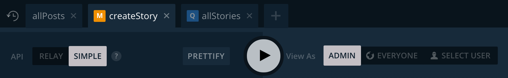

# Playground

The GraphQL **Playground** lets you explore the [GraphQL API](!alias-heshoov3ai) of your project and run queries, mutations and even subscriptions. It is based on the open source tool [GraphiQL](https://github.com/graphql/graphiql) by Facebook.

## Running GraphQL operations

The main feature of the GraphQL Playground is **running queries, mutations and subscriptions**. It also comes with autocompletion against your GraphQL schema:

When executing a subscription, you will  **receive subscription events right in the Playground**! You can combine this with executing mutations in another Playground tab to test how subscriptions and mutations interact.

> All GraphQL operations support the use of [GraphQL Variables](!alias-thaexex7av). Simply declare them in the query editor and supply the desired values in the query variables input field.

## Advanced Features

### History log and tabs

If you need to run a lot of different GraphQL operations, you can simply add new tabs

### Selecting API Endpoint

For each tab, you can choose to run queries to the [Simple or Relay API](!alias-heshoov3ai).

### Authenticating as a user

In the Playground you can choose to run GraphQL operations either as `ADMIN` (all operations are allowed), `EVERYONE` or a specific user.
