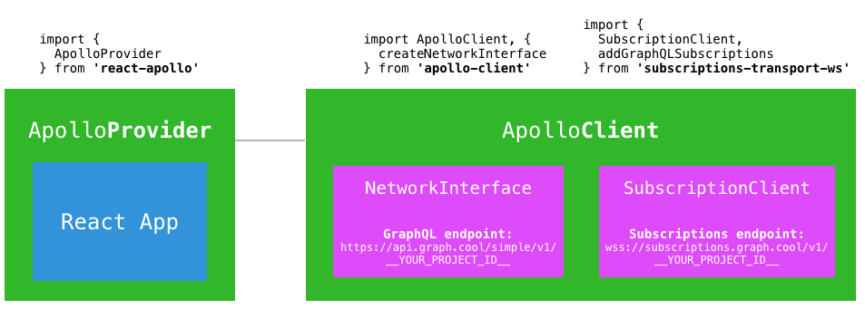

# Freecom Tutorial: Realtime Updates with GraphQL Subscriptions (3/6)

<InfoBox type=warning>

**Note**: This guide is only applicable to [legacy Console project](!alias-aemieb1aev). It doesn't work with the new [Graphcool Framework](https://blog.graph.cool/graphcool-framework-preview-ff42081b1333) which is based on the [`graphcool.yml`](!alias-foatho8aip) service definition file.

An updated version of this guide is coming soon, stay tuned!

</InfoBox>

This is the third chapter of our tutorial series where we teach you how to build a fully-fledged Intercom clone using Graphcool and Apollo Client. In the [last chapter](!alias-oe8ahyo2ei), you learned how to develop the fundament for the app by configuring Apollo and setting up the required queries and mutations. Today is all about getting the realtime functionality into our app!⚡️

<iframe height="315" src="https://www.youtube.com/watch?v=mJMYyniCJe4" frameborder="0" allowfullscreen></iframe>


## What are GraphQL Subscriptions?

[Subscriptions](http://graphql.org/blog/subscriptions-in-graphql-and-relay/) are a GraphQL feature that allow you to get **realtime updates** from the database in a GraphQL backend. You set them up by _subscribing_ to changes that are caused by specific _mutations_ and then execute some code in your application to react to that change.

Using Apollo Client, you can benefit from the full power of subscriptions. Apollo [implements subscriptions based on web sockets](https://dev-blog.apollodata.com/graphql-subscriptions-in-apollo-client-9a2457f015fb#.fapq8d7yc).

The simplest way to get started with a subscription is to specify a callback function where the modified data from the backend is provided as an argument. In a chat application you might be interested in any changes on the `Message` type. This can be either a _new message has been sent_, _an existing message was modified_ or an _existing message was deleted_. The code for such a subscription could look as follows:

```js
// subscribe to `CREATED`, `UPDATED` and `DELETED` mutations
this.newMessageObserver = this.props.client.subscribe({
  query: gql`
    subscription {
      Message {
        mutation # contains `CREATED`, `UPDATED` or `DELETED`
        node {
          ideate
          text
        }
      }
    }
  `,
  }).subscribe({
      next(data) {
      console.log('A mutation of the following type happened on the Message type: ', data.Message.mutation)
      console.log('The changed data looks as follows: ', data.Message.node)
    },
    error(error) {
      console.error('Subscription callback with error: ', error)
    },
})
```

> Note: This code assumes that you have configured and set up the `ApolloClient` and made it available in the `props` of your React component using [`withApollo`](http://dev.apollodata.com/react/higher-order-components.html#withApollo), just like we saw in the previous chapter. We'll explain how to setup the `ApolloClient` for subscriptions in just a bit.


## Figuring out the Mutation Type

The _kind_ of change that happened in the database is reflected by the `mutation` field in the payload which contains either one of the three values:

- `CREATED`: for a node that was _added_
- `UPDATED`: for a node that was _updated_
- `DELETED`: for a node that was _deleted_


## Getting Information about the changed Node

The `node` field in the payload allows us to retrieve information about the modified data record. It is also possible to ask for the state that node had _before_ the mutation. You can do so by including the `previousValues` field in the payload:

```graphql
subscription {
  Message {
    mutation # contains `CREATED`, `UPDATED` or `DELETED`
    # node carries the new values
    node {
      text
    }
    # previousValues carries values from before the mutation happened
    previousValues {
      text
    }
  }
}
```

Now you could compare the fields in your code like so:

```js
next(data) {
  console.log('Old text: ', data.Message.previousValues.text)
  console.log('New text: ', data.Message.node.text)
}
```

If you specify `previousValues` for a `CREATED` mutation, this field will just be `null`, this is logical because there were no previous values for that node because it was just created. Similarly, the `node` for a `DELETED` mutation will be `null` as well, but you can access the latest state of the deleted node through `previousValues`.

Also notice that `node` will give you access to values from related fields while `previousValues` can only access fields from the type itself. So for the `Message` mutation, it would be possible to access fields of the `agent` of a message:

```graphql
# this works
node {
  text
  agent {
    id
  }
}

# this does NOT!
previousValues {
  text
  agent {
    id
  }
}

```


## Subscriptions with Apollo

Apollo uses the concept of an `Observable` (which you might be familiar with if you have worked with [RxJS](https://github.com/Reactive-Extensions/RxJS) before) in order to deliver updates to your application.

Rather than using the updated data manually in a callback, you can benefit from further Apollo features that conveniently allow you to update the local `ApolloStore` which contains the cached data from previous queries.

> **Tutorial Workflow**
>
> We're hosting all the code for the tutorial on [GitHub](https://github.com/graphcool-examples/freecom-tutorial). Each chapter comes with _two_ folders:
> 1. `freecom-0X`:  Contains the starter code for chapter `X`
> 2. `freecom-0X-final`: Contains the final code for chapter `X` and serves as a reference solution if you get lost along the way
>
> Each written chapter gives a high-level overview on the current topic. For step-by-step instructions watch the corresponding video.


### Setting up the `ApolloClient` to use Subscriptions

To use subscriptions in your app, you need to configure the `ApolloClient` accordingly. This time, in addition to the GraphQL endpoint, we also need to provide a `SubscriptionClient` that handles the websocket connection between our app and the server.



To find out more about how the `SubscriptionClient` works, you can visit the [repository](https://github.com/apollographql/subscriptions-transport-ws) where it's implemented. Let's now see how we can to setup the `ApolloClient` and prepare it for using subscriptions.

First, in order to use the `SubscriptionClient` in your application, you need to add it as a dependency:

```sh
npm install subscriptions-transport-ws --save
```

Once you've installed the package, you can instantiate the `SubscriptionClient` as follows (adjusting the setup of the `ApolloClient` that we saw in the previous chapter):

```js
import ApolloClient, { createNetworkInterface } from 'react-apollo'
import {SubscriptionClient, addGraphQLSubscriptions} from 'subscriptions-transport-ws'

// Create WebSocket client
const wsClient = new SubscriptionClient(`wss://subscriptions.graph.cool/v1/__YOUR_PROJECT_ID__`, {
  reconnect: true,
})
const networkInterface = createNetworkInterface({ uri: 'https://api.graph.cool/simple/v1/__YOUR_PROJECT_ID__' })

// Extend the network interface with the WebSocket
const networkInterfaceWithSubscriptions = addGraphQLSubscriptions(
  networkInterface,
  wsClient
)

const client = new ApolloClient({
  networkInterface: networkInterfaceWithSubscriptions,
})
```


### Integrate Subscriptions for realtime Updates in the `Chat`

Considering the `Chat` component in Freecom, essentially only one query and one mutation are required to enable the `Customer` and the support `Agent` to have a `Conversation` where they can exchange messages:

```js
const createMessage = gql`
  mutation createMessage($text: String!, $conversationId: ID!) {
    createMessage(text: $text, conversationId: $conversationId) {
      id
      text
    }
  }
`

const allMessages = gql`
  query allMessages($conversationId: ID!) {
    allMessages(filter: {
      conversation: {
        id: $conversationId
    }
  }) {
      id
      text
    }
  }
`
```

> Note: This code is slighlty simplified compared to the version we're using in the [video series](https://www.youtube.com/watch?v=mJMYyniCJe4)!

Let's now see how we can use a subscription to get the promised realtime updates in our code. As mentioned before, we need to subscribe to the `allMessagesQuery`:

```js
// Subscribe to `CREATED`-mutations
this.createMessageSubscription = this.props.allMessagesQuery.subscribeToMore({
  document: gql`
    subscription {
      Message(filter: {
        mutation_in: [CREATED]
      }) {
        node {
          id
          text
        }
      }
    }
  `,
  updateQuery: (previousState, {subscriptionData}) => {
    const newMessage = subscriptionData.data.Message.node
    const messages = [...previousState.allMessages, newMessage]
    return {
      allMessages: messages,
    }
  },
  onError: (err) => console.error(err),
})
```

Notice that we're using a different method to subscribe to the changes compared to the first example where we used `subscribe` directly on an instance of the `ApolloClient`. This time we're calling [`subscribeToMore`](http://dev.apollodata.com/react/receiving-updates.html#Subscriptions) on the `allMessagesQuery`, which is available in the `props` of our component because we wrapped it with `graphql` before.

Next to the actual subscription that we're passing as the `document` argument to `subscribeToMore`, we're also passing a function for the `updateQuery` parameter. This function follows the same principle as a [Redux reducer](http://redux.js.org/docs/basics/Reducers.html) and allows us to conveniently merge the changes that are delivered by the subscription into the local `ApolloStore`. It takes in the `previousState` which is the the former _query result_ of our `allMessagesQuery` and the `subscriptionData` which contains the payload that we specified in our subscription. In the implementation, we then retrieve the new message by accessing the `node` property of the specified payload.

> From the Apollo [docs](http://dev.apollodata.com/react/receiving-updates.html#Subscriptions): `subscribeToMore` is a convenient way to update the result of a single query with a subscription. The `updateQuery` function passed to `subscribeToMore` runs every time a new subscription result arrives, and it's responsible for updating the query result.

Fantastic, this is all we need in order for our chat to update in real-time! 🚀 If you want to learn more about subscriptions, check out our [example app](https://demo.graph.cool/worldchat) or the [documentation](!alias-aip7oojeiv).


## Wrap Up

In today's chapter, you learned how you can bring realtime functionality to your app using GraphQL subscriptions. Calling `subscribeToMore` on a query allows to subscribe to changes happening in the database and specify what information you want to receive upon every change. By further passing a reducer function for `updateQueries` to the same call, you can directly specify how the new data should get merged into the previous query results.

In the next chapter, we're going to enable support agents to join the chat by integrating serverless functions that we use to access the Slack API.

Let us know how you like the tutorial or ask any questions you might have. Contact us on [Twitter](https://twitter.com/graphcool) or join our growing community on [Slack](http://slack.graph.cool/)!

<!-- FREECOM_SIGNUP -->
