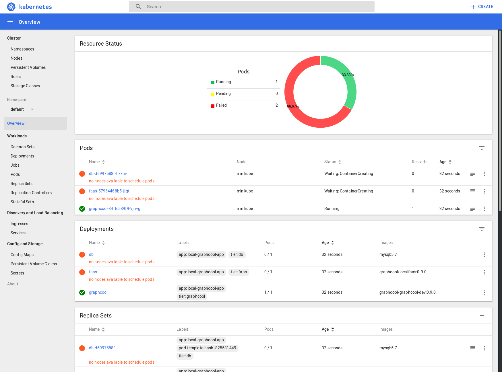
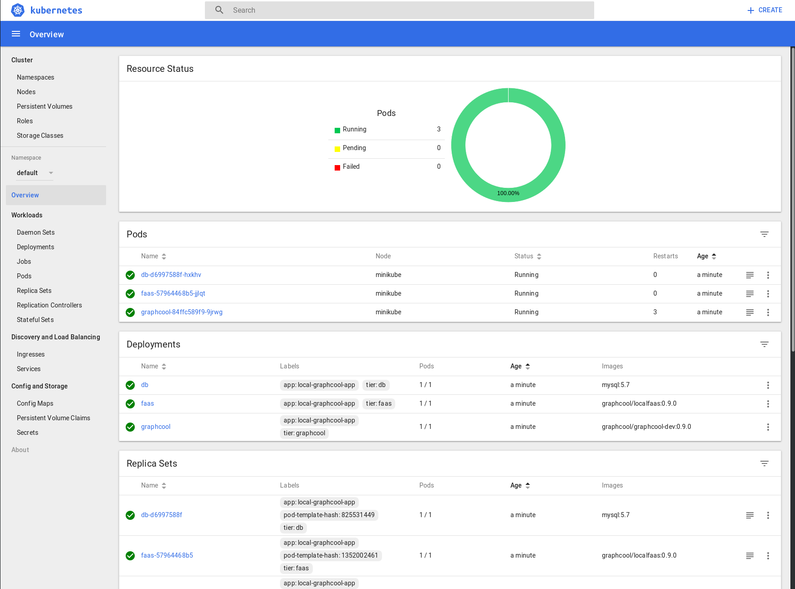
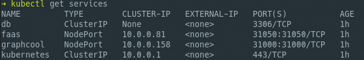
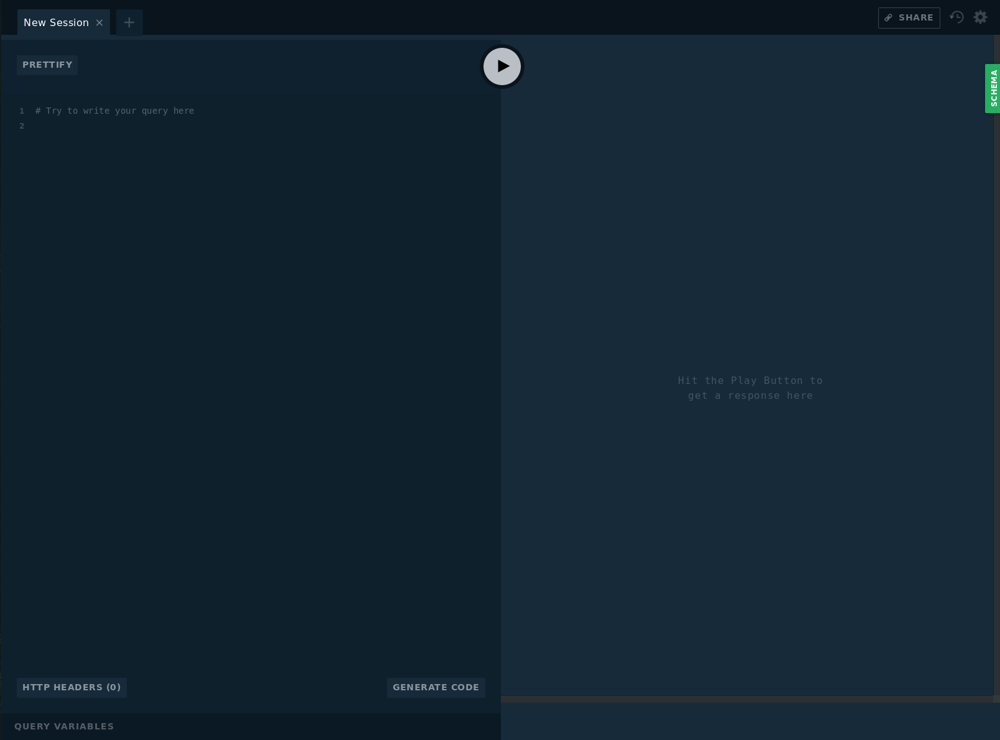
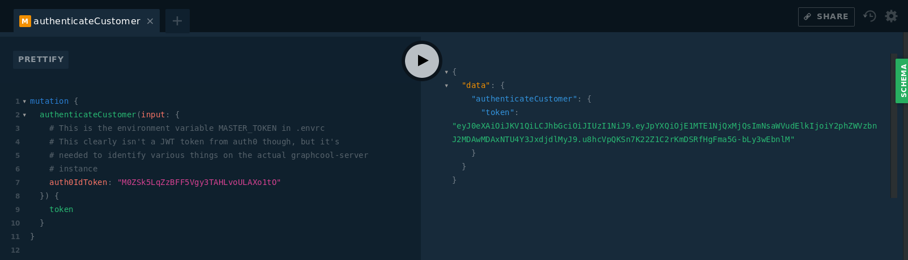
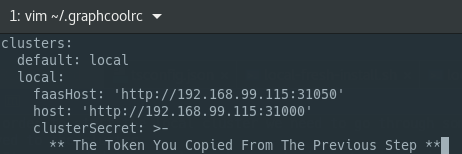
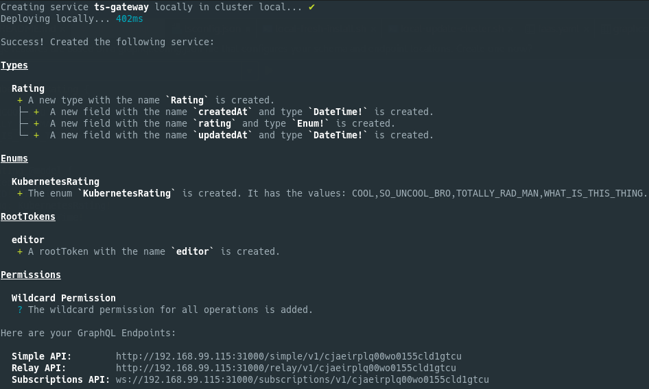
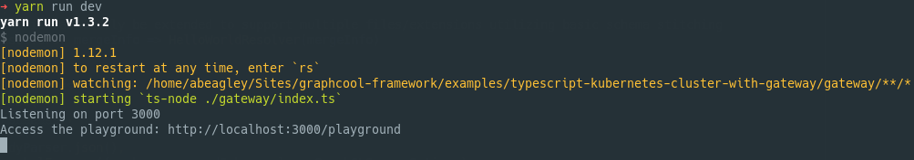
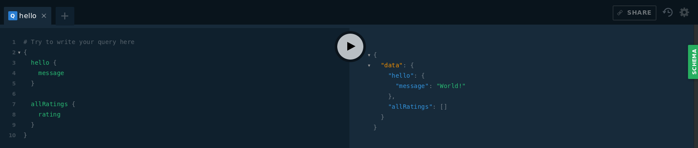

# Kubernetes Cluster (w/ API Gateway)

## Overview

This is an example implementation for working within the current
transition state of graphcool from BaaS to an open framework and
utilizing kubernetes for cluster deployment with the local deployment 
images. This can easilly be utilized for the GCP kubernetes container
engine and allow you to deploy a graphcool application to a custom
cloud there. I assume the ease of doing something like this will get 
better as graphcool matures as a framework.

## What we'll cover

- The initialization of kubernetes services, deployments, secrets, and persistant volumes
needed to run Graphcool in a cluster
- Utilizing `graphcool deploy` in order to update our graphcool deployment like we would
with the standard docker deployments
- Taking advantage of a custom gateway (express / apollo-server) that communicates with the 
internal graphcool service 
- A basic conceptual understanding of taking this into a GCP Kubernetes Container cluster in graphcool's
current state

## Getting Started

### 1. Dependencies
In order for graphcool to work with kubernetes you'll need the following dependencies for
this tutorial. Install these in order if you're just getting started with kubernetes:

- [KubeCTL](https://kubernetes.io/docs/tasks/tools/install-kubectl/#install-kubectl-binary-via-curl)
- [VirtualBox](https://www.virtualbox.org/wiki/Downloads)
- [Minikube](https://github.com/kubernetes/minikube)
- [Graphcool CLI](https://graph.cool/docs/reference/graphcool-cli/overview-zboghez5go)
- [direnv](https://direnv.net/) - don't forget the shell integration setup after install
- If you're using WebStorm: [Base64 Helper](https://plugins.jetbrains.com/plugin/7372-base64-helper)
    - If you're not using WebStorm I highly recommend you look into an addon
    that will encode/decode base64 for you. Secrets in Kubernetes are base64 encoded and it's nice to
    have an addon to handle that for you.
    
### 2. Kubernetes Setup
1. Eject your graphcool project with `graphcool eject`. If you're starting a new graphcool project. 
Don't forget to `graphcool init` before you do this. If you simply cloned this example it's already been ejected.
    - This provides us with the necessary environment variables to initialize a graphcool standalone instance
    - There are a lot of variables right now that we will simply ignore and not utilize on the GCP/Local platform
2. Allow `direnv` to append the environment variables from `.envrc` 
    - Run `direnv allow`. you will have to do this everytime `direnv` notices a change to your `.envrc`
3. Kubernetes works off of definitions (built in YAML) to describe different concepts for working with a cluster.
We need to essentially take what we get from `graphcool eject` and it's `docker-compose.yml` file and convert it to
something kubernetes understands.
    - All of the configuration you need to deploy a local kubernetes cluster to run graphcool is stored within the `./config/local` folder
    - Each one of these files is an all-in-one configuration for a particular piece in our kubernetes cluster
4. In order to start the local cluster we need to go through some setup steps to get these configuration files
deployed to the cluster
    - I've provided two simple bash scripts in `./scripts` in order to expedite the initial setup and updating
    process. These scripts just run the appropriate `kubectl` and `minikube` commands in order to setup a local cluster.
    - To create a fresh install of the local cluster run: `./scripts/local-fresh-install.sh`
    - To update the concepts after modifying the kubernetes `yaml` files run: `./scripts/local-update-cluster.sh`
5. After you create your cluster go ahead and open up the kubernetes dashboard by running `minikube dashboard`
Since we're deploying everything at once you may get a dashboard result like the following initially:
- Keep in mind that one of the benefits of kubernetes is a self-repairing architecture. We have these
errors initially because some of our deployments depend on other services that haven't fully initialized yet. Kubernetes
is smart enough to restart the pods that are failing due to these dependency issues. 

- After a couple restarts from certain pods (automatically handled by kubernetes) we will get the following:

6. Congrats! From the kubernetes cluster deployment standpoint you now have a fully loaded local cluster running on
a `minikube` instance. Now we have to do some configuration in order for `graphcool deploy` to be able deploy to it.

### 3. Graphcool CLI Setup
1. It's worth noting at this point that you will need to get familiar with two files for environment configuration. The
`./config/local/secrets.yaml` hosts a copy of the `.envrc` variables that graphcool-cli would use. Thus if you change something
in one make sure you mimic the change in the other. This tutorial focuses on a dev environment which exposes the ports required
to run `graphcool deploy` on the host machine and update the graphcool service running within the minikube VM. This changes
as you move to production because you'll need to package the gateway api as a Docker container and create a new yaml file
to handle that container for kubernetes.
    - We'll be using the minikube ip directly in order to have graphcool-cli communicate with our containers. You'll notice
    our Graphcool and FaaS service declarations have a NodePort property that exposes that service directly to our host. We
    need to configure graphcool-cli to connect to these exposed services in order to deploy changes to our functions and types.
    - Minikube's IP can change and will change if you destroy a VM and re-create it. You can get the current IP at any time by
    running `minikube ip`
2. In order for us to setup a local cluster that graphcool-cli can use we need to have a token given to us from the `/system`
endpoint hosted within our graphcool service inside of our cluster. This process is automatic in the docker-compose version,
but we have to do this step manually for our kubernetes cluster.
    - Run: `kubectl get services`
    
    
    - I want to direct your attention here to the PORT(S) section. We can see our graphcool service is running and has port 31000
    exposed. Now run: `minikube service graphcool --url`
    
    
    - This returns us the actual url our host can access in order to hit the appropriate service. Go ahead and open the url followed
    by `/system` 
    
    
    - We're greated with the familiar graphcool playground, but it's not the traditional one we get with our own services. This
    particular one is for creating various services that live within the cluster. It's what we have to use to manually get the 
    token required for `graphcool deploy` to use in order to get it to connect to the cluster automatically. Go ahead and add
    the following mutation and hit the play button:
    
    
    - The response from this mutation is essentially the secret we need in order for graphcool cli to authenticate and utilize our
    own home-brewed cluster. Go ahead and copy the JWT token between the two `"` we'll need it for the next step.
    
3. You should have a `.graphcoolrc` file located in your home directory by now. If you don't you can simply run `graphcool login`
and one will be generated for you with your platform token filled in from your login information. When you run `graphcool local up`
it creates a new configuration called `local` that contains information about how to interact with a local docker cluster. We
don't have that luxury here (yet) so we need to add this in manually so it utilizes our kubernetes cluster instead of a generated
docker one.
    - Open up `~/.graphcoolrc` with your favorite editor
        - Add the following below or above your platformToken declaration:
        
        
        
        - Save your changes
4. Now lets see if we got it right. From within the root directory of your project (the one with your `graphcool.yml`) run:
`graphcool deploy` and select the local target.

    

    - Everything else you'd expect to work with the CLI is working as well. In order to get the root token that was created we run:
    
    
    
5. Phew! That was some fun setup there, but we managed to get the CLI working just like it would with the `docker-compose.yml` file. We
also have endpoints now to work with our api like we normally would by just starting a standard graphcool project. If you don't plan to 
utilize a custom gateway to interact with your graphcool api feel free to pat yourself on the back and stop the tutorial here.

### 4. Custom API Gateway

1. This part of the tutorial focuses on some of the same material as the other api-gateway tutorial in this repo. I highly encourage
you to read through that one as well.
2. The idea here is to extend the graphcool api allowing us to essentially cut off the world from our graphcool api instance and
add our own pieces to the puzzle, so to speak. This example utilizes express, apollo-server, and typescript to communicate with
our instance running in our cluster through an exposed port. Keep in mind the goal here would be to NOT expose the graphcool api to
the general public in a production environment, but to essentially proxy to it through the gateway. Thus if I were configuring my 
kubernetes cluster for production the only service exposed to the real world would be this gateway and my ui.
3. In order to start the custom gateway on your localhost run `yarn install` followed by `yarn run dev` if it was able to
connect to the graphcool service in the kubernetes cluster you'll see something like:

    

    - If you see a 500 error it probably means that you haven't changed the appropriate IP variable located inside `.envrc`
    to your minikube's current ip
4. With the gateway started you can access the playground with the displayed URL. 

    
    
    - You'll notice you have access to all of your graphcool queries and mutations as well as our custom query that the gateway
    is providing. If you want to limit this I suggest going through the other gateway tutorial.
    
## In Conclusion

It takes a bit of work in Graphcool's current transitional state, but at the end of the day it's really not that bad to setup
in a kubernetes cluster. Essentially a few things in this example would need to change in order to support GCP fully but they're
just configuration changes. I've tested a full deploy with GCP Storage and GCP Cloud SQL and have had great success. The only problem
stems from the current dev image containers. I assume things will get easier and there will be less variables to mess around with
once Graphcool framework hits V1.
